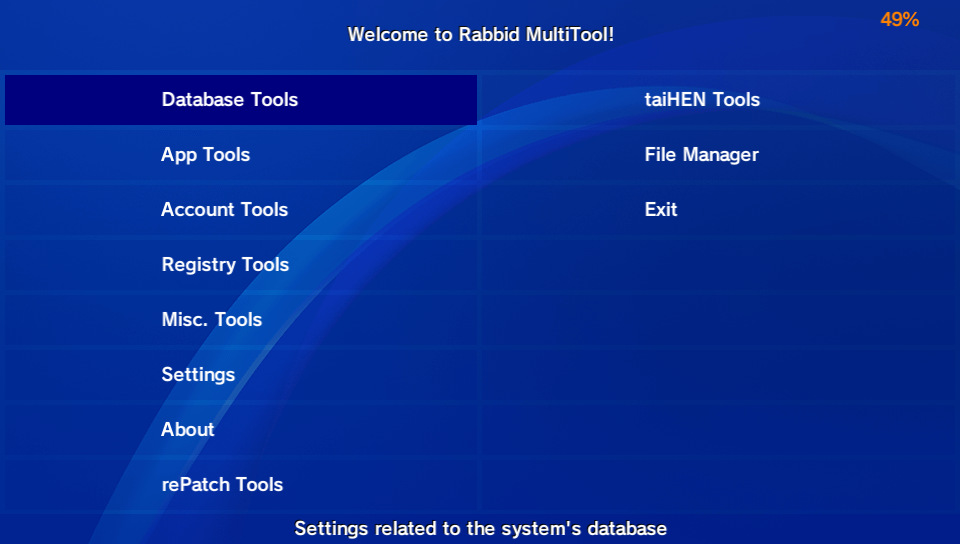

# Rabbid MultiTool
A powerful toolbox for the PS Vita which combines multiple homebrew utilities into one. It only does everything!

## Features
### Database Tools
* **Back up icon layout**: Backs up the app database & icon layout to use it in case of restoring your bubble layout.
* **Restore backed up icon layout**: Self-explanatory, restores your previously backed up app database & icon layout.
* **Update database**: Also self-explanatory, triggers a database update. Doing this wipes your custom themes from the database and you'll have to add them back using a custom theme manager. Official themes aren't affected and will stay.
* **Rebuild database**: Self-explanatory yet again, triggers a database rebuild. Doing so wipes your bubble layout. It can be restored by using the aforementioned backup/restore app database option.
* **Import Media**: Imports media to the database, meaning it can be accessed by using the system media apps.
### App Tools
Once clicked, a list will show with all the apps installed, system apps present in the app database and official (not Adrenaline) PSP/PS1 bubbles. You can add a custom icon and livearea images to an app in the specified folder aswell as change the app's name. This is not possible with system apps yet and not tested with any PSP/1 bubbles.
### Account Tools
* Show account info: Self-explanatory, displays your PSN account info such as password or ID.
* Back up PSN account: Backs up the current PSN account in a folder named after the current ID of your PSN account.
* Restore PSN account: Restores/switch an account from your account backups made with Rabbid MultiTool.
### Registry Tools
* Reset parental passcode: Resets the Parental Controls passcode, useful in cases of purchasing a Vita with a parental passcode & settings left and forgotten by the previous owner(s).
* Reset screen lock passcode: Resets the lockscreen passcode, allowing to go directly to the Livearea without typing a passcode.
* Modify a registry key: You can modify a registry key from the system's registry to whatever you like/want.
### Miscellaneous Tools
* Font Previewer
* .SFO Tools
* Open URI
* Scan QR code
* Configure PKGj settings
* File Downloader
* USB & FTP
### rePatch Tools
Manages your games that use rePatch (enable & disable games from using rePatch). In order for the menu item to appear in the main menu you need to have the rePatch plugin installed.
### taiHEN Tools
Manages your plugins on your Vita (like to enable & disable plugins).
### File Manager
Obvious. Manages your files. It can open images and play music & videos. Do note that some audio files may scuff up and play distorted. This is a problem in the interpreter itself. It can also install .VPKs, extract .PBPs and edit files. The interface might seem a bit familliar if you've used VitaShell (99% did).
## Partition Tools
Allows you to remap partitions. Useful if you're setting up your SD2Vita or something similar.
### Settings
* Show icons in app list: Enable/disable icon preview in the app list of **App Tools**. It's recommended to turn this off as having it on might cause lag/freezing issues and sometimes either a C stack overflow error or a GPU crash.
* Use custom background
* Use custom font
* Change highlight color
* Language (soon)
* Check for updates
### Other Additions
Auto-Updating is now a thing, you can now update directly within the app. This will affect versions 0.10 and onwards, as versions 0.09 or below need to be updated manually because they don't have auto-updating. The code is sourced from other official OneLua apps.
## Credits
* OneLua team for their Lua interpreter and their past apps.
### Translations besides English
* theheroGAC for translating to Italian
* Harommel (me) & Chronoss for translating to French
